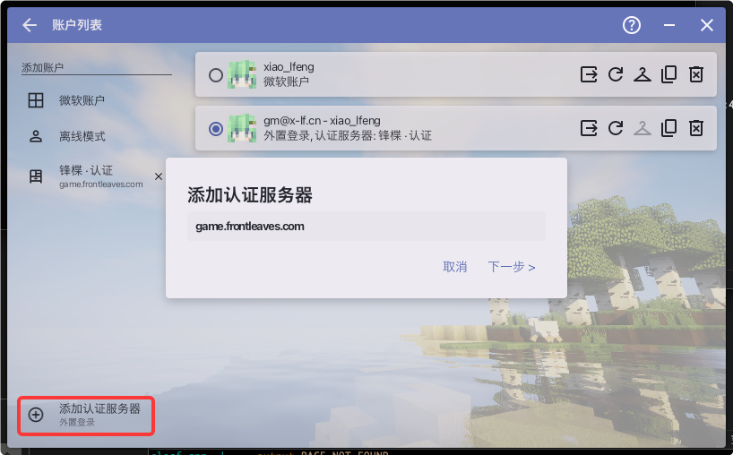
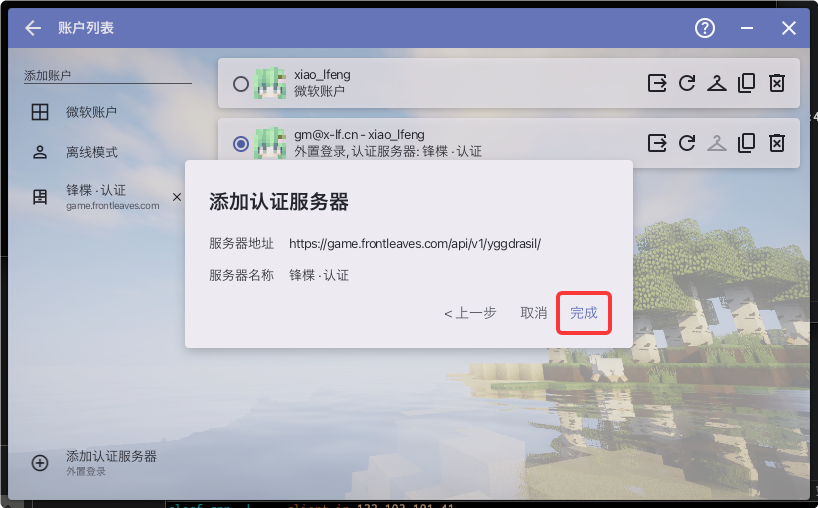
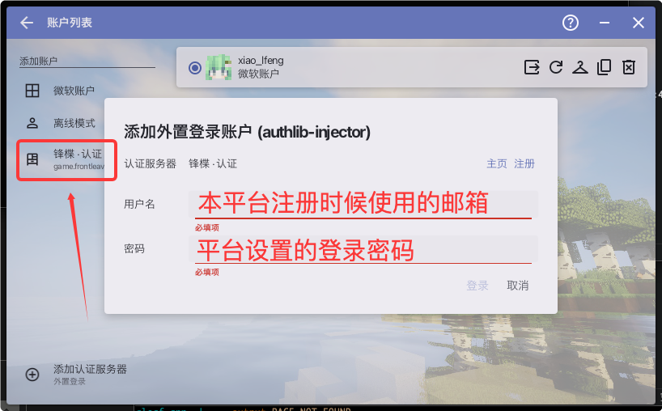
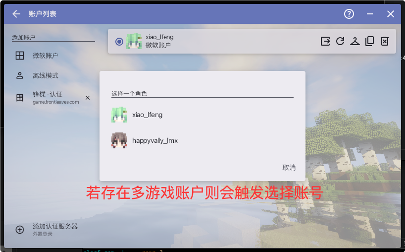
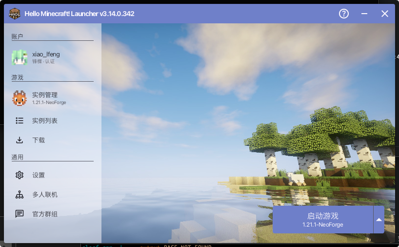

# HMCL 连接锋楪认证

本文将指导你使用 **HMCL（Hello Minecraft! Launcher）** 连接锋楪认证服务器，以便在 HMCL 启动器中登录并游玩 Minecraft。

## 前提条件

- 已安装 [HMCL 启动器](https://hmcl.huangyuhui.net/)（建议 v3.5 及以上版本）
- 已在锋楪平台注册账号

## 第一步：打开账户管理

启动 HMCL，点击左侧导航栏中的 **账户** 区域，进入账户列表页面。

然后点击左侧下方的 **「添加认证服务器」**（标注为「外置登录」）按钮。



## 第二步：检查认证服务器地址

在弹出的「添加认证服务器」对话框中，检查认证服务器地址：

```
https://game.frontleaves.com/api/v1/yggdrasil/
```

填写完成后，点击 **「下一步」**。



## 第三步：确认服务器信息

系统将自动识别并填充服务器名称（如「锋楪 - 认证」）。确认服务器地址和名称无误后，点击 **「完成」** 按钮。



## 第四步：登录账户

认证服务器添加完成后，在左侧导航栏中选择刚添加的认证服务器，进入登录界面：

- **用户名**：填写你在锋楪平台注册时使用的邮箱
- **密码**：填写你在锋楪平台设置的登录密码

填写完毕后，点击 **「登录」**。



## 第五步：选择角色（可选）

如果你的账户下绑定了多个 Minecraft 游戏角色，登录后会弹出「选择一个角色」对话框。选择你想要使用的角色即可。

若只有一个角色，则此步骤会自动跳过。



## 完成

全部设置完成后，你可以在 HMCL 主页看到当前账户已登录，选中对应的游戏实例，点击 **「启动游戏」** 即可开始游玩。

> 💡 **提示**：如果登录后皮肤显示异常，可以在平台内上传自己的皮肤。
