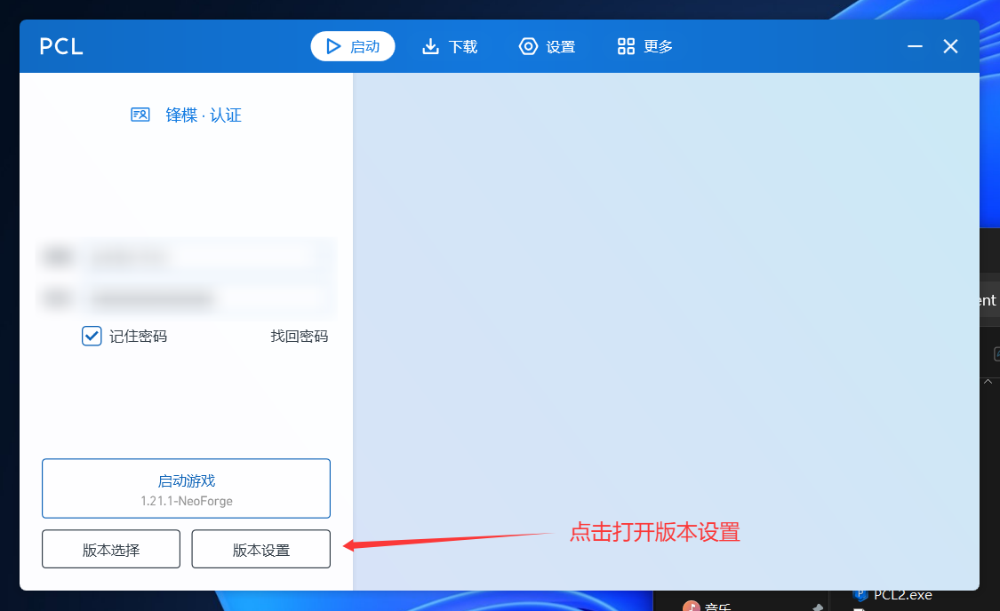
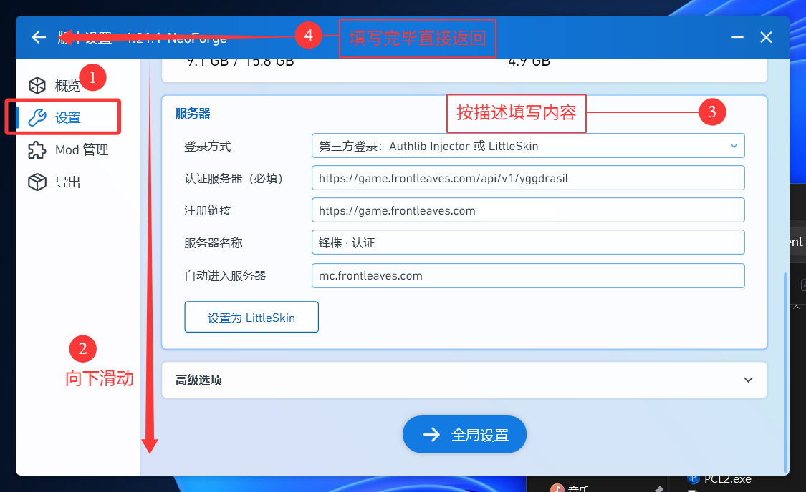
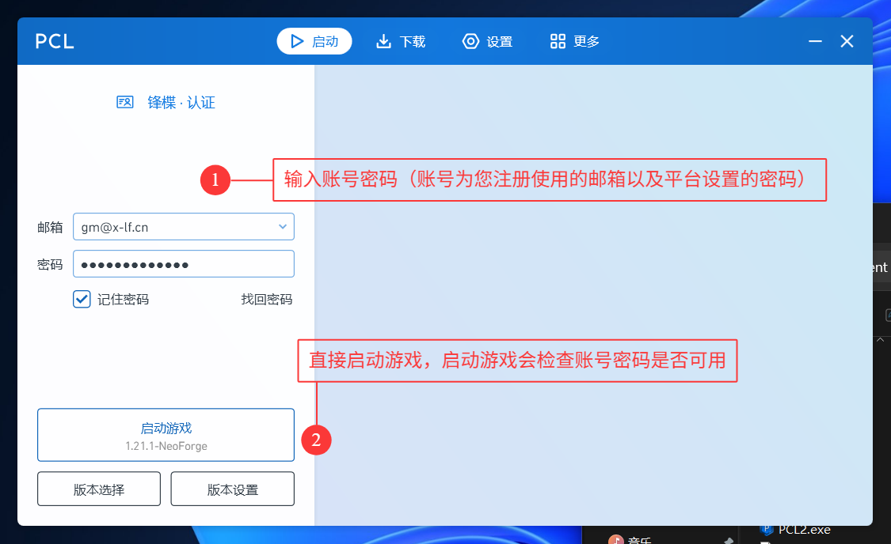
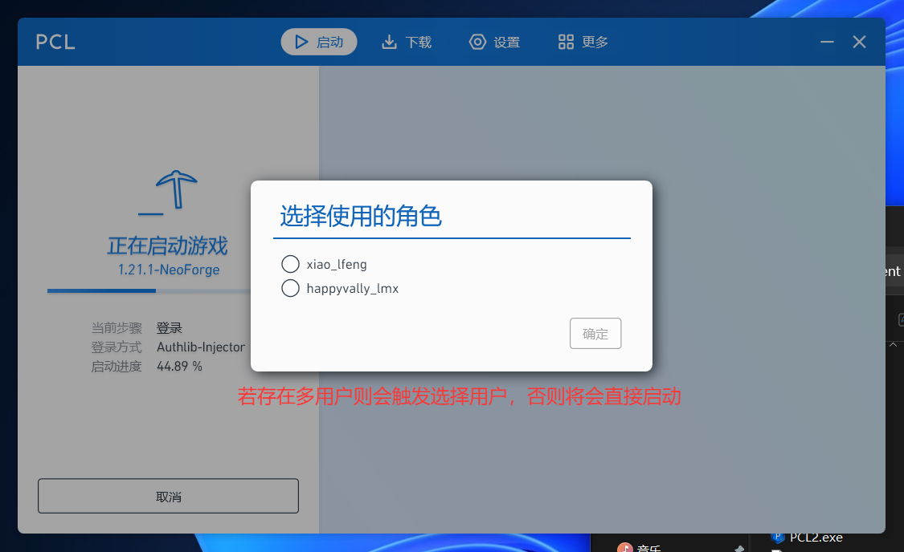

# PCL 连接锋楪认证

本文将指导你使用 **PCL（Plain Craft Launcher 2）** 连接锋楪认证服务器。

## 前提条件

- 已安装 [PCL2 启动器](https://pcl2.aoe.top/)（建议最新正式版）
- 已在锋楪平台注册账号
- 已下载对应的 Minecraft 游戏版本（如 1.21.1-NeoForge）

## 第一步：打开版本设置

在 PCL 主页中，选中你要游玩的游戏版本，点击下方的 **「版本设置」** 按钮。

## 第二步：配置外置登录

### 进入设置页面

在版本设置页面的左侧导航栏中，点击 **「设置」** 选项卡。

### 填写服务器信息

向下滚动到 **「服务器」** 配置区域，按照以下内容填写：

| 配置项 | 填写内容 |
| --- | --- |
| **登录方式** | 第三方登录：Authlib Injector 或 LittleSkin |
| **认证服务器**（必填） | `https://game.frontleaves.com/api/v1/yggdrasil` |
| **注册链接** | `https://game.frontleaves.com` |
| **服务器名称** | `锋楪 · 认证` |
| **自动进入服务器** | `mc.frontleaves.com` |

填写完成后，直接点击左上角返回箭头即可保存配置。

## 第三步：登录并启动游戏

返回 PCL 主页，确认左侧显示 **「锋楪 · 认证」** 后：

- **邮箱**：填写你在锋楪平台注册时使用的邮箱
- **密码**：填写你在锋楪平台设置的登录密码

填写完毕后，点击 **「启动游戏」**。启动器会自动验证账号密码是否可用。

## 第四步：选择角色（可选）

如果你的账户下绑定了多个 Minecraft 游戏角色，启动过程中会弹出「选择使用的角色」对话框。选择你想要使用的角色，点击 **「确定」** 即可。

若只有一个角色，则此步骤会自动跳过，直接进入游戏。

## 完成

游戏将自动启动并连接到 `mc.frontleaves.com` 服务器。祝你游玩愉快！

> 💡 **提示**：你可以勾选「记住密码」来避免每次启动都重新输入。
